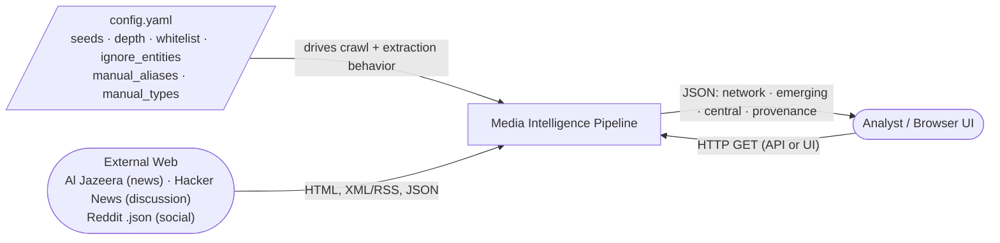
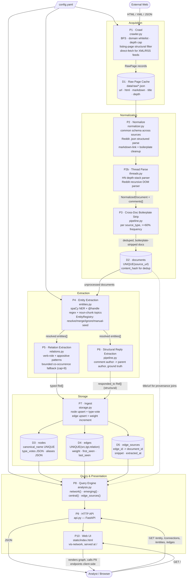
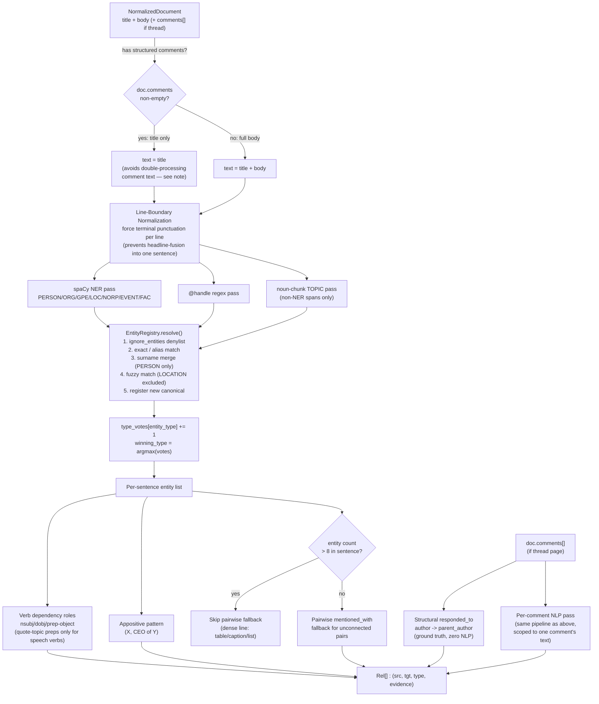
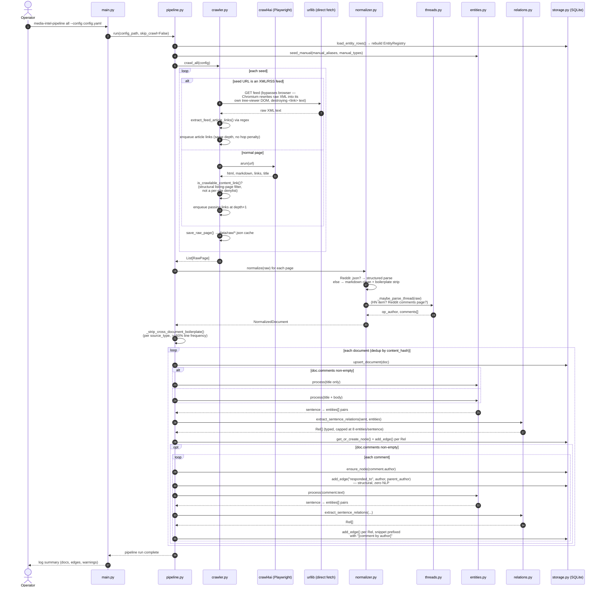
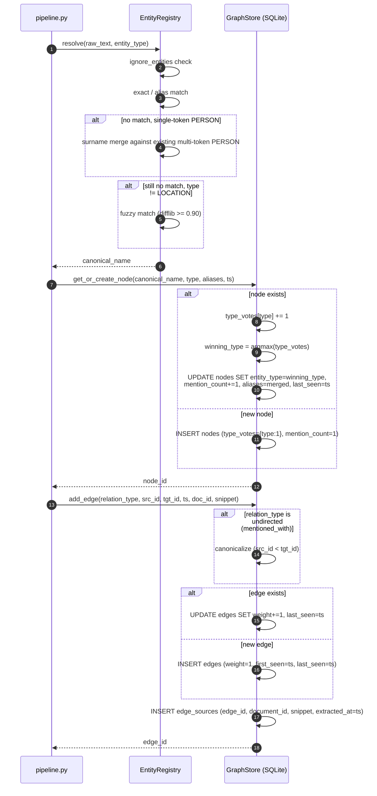
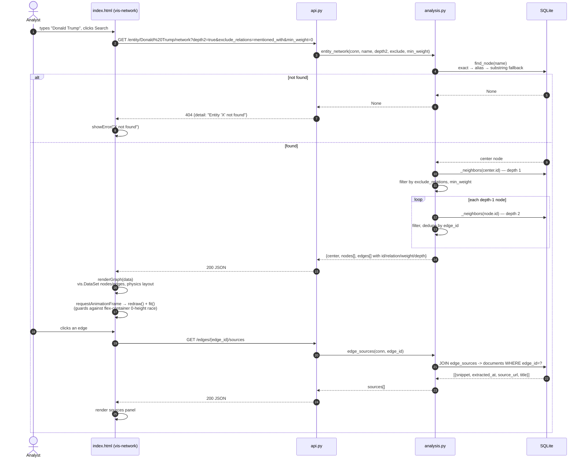
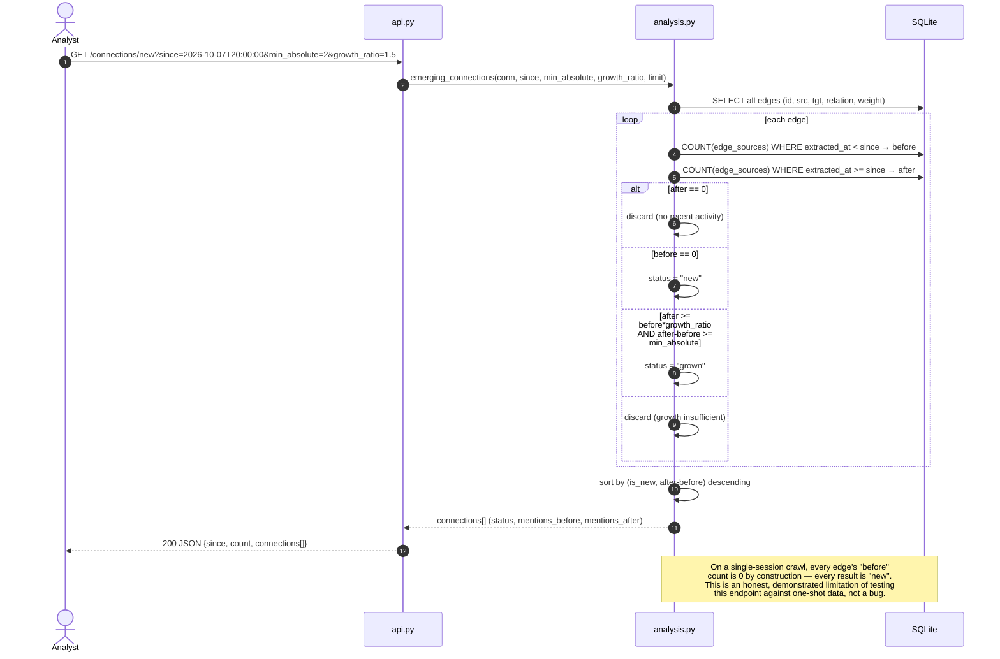
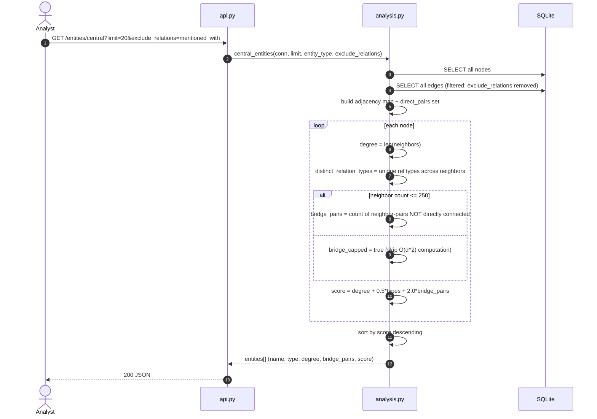
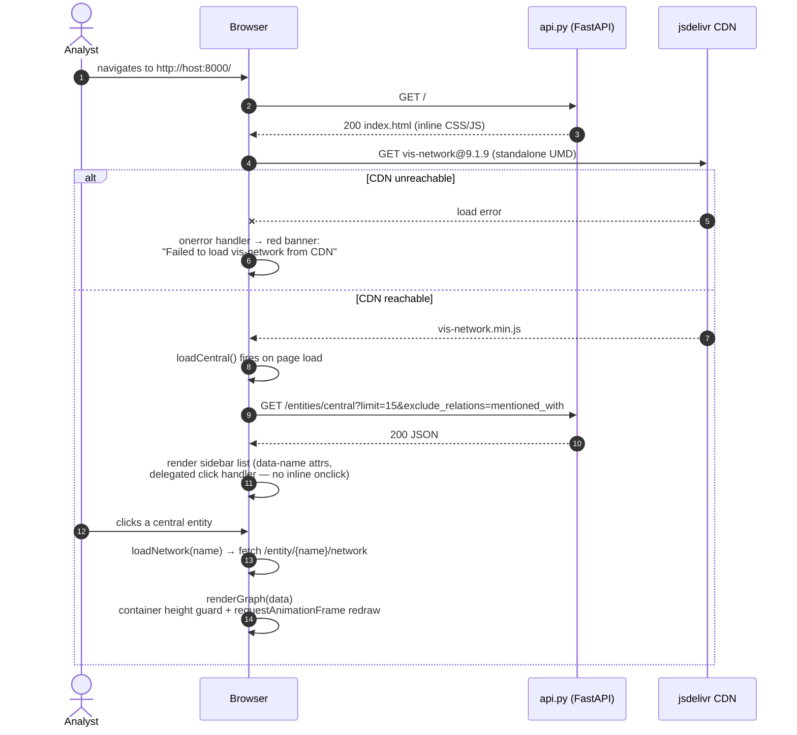

# Media Intelligence Graph

A pipeline that crawls real news, discussion, and social content, extracts named entities and typed relationships between them using rule-based + statistical NLP (no paid APIs), stores the result as an explicit nodes/edges graph in SQLite, and exposes it through a FastAPI query layer built for analyst workflows: network traversal, emerging-connection detection, and centrality ranking.

This README documents what was actually built, what actually broke during development against real scraped data, and the specific, evidence-backed decisions made in response. Every claim in Phase 4 references a concrete example from this project's own crawl output — not hypothetical failure modes.

---

## Table of Contents

1. [Setup](#setup)
2. [Architecture](#architecture)
3. [Architecture v2 — End-to-End DFD & Sequence Diagrams](#architecture-v2--end-to-end-dfd--sequence-diagrams-current-implementation)
4. [Design Notes Encoded in These Diagrams](#design-notes-encoded-in-these-diagrams)
5. [Why Three Sources](#why-three-sources-and-what-each-one-actually-is)
6. [UI](#ui)
7. [Crawling Obstacles](#crawling-obstacles)
8. [Entity Normalization](#entity-normalization--design-and-how-it-actually-broke)
9. [Relationship Extraction](#relationship-extraction--design-and-how-it-actually-broke)
10. [Storage Schema](#storage-schema)
11. [API Endpoints](#api-endpoints)
12. [Phase 4 — The Hard Questions](#phase-4--the-hard-questions)

---

## Setup

Requires Python 3.12 and [`uv`](https://docs.astral.sh/uv/). Only the **Playwright system dependencies** step differs by OS — everything else (`uv sync`, spaCy model download, running the pipeline) is identical everywhere.

### 1. Install `uv`

| OS                   | Command                                                                               |
| -------------------- | ------------------------------------------------------------------------------------- |
| macOS / Linux        | `curl -LsSf https://astral.sh/uv/install.sh \| sh`                                    |
| Windows (PowerShell) | `powershell -ExecutionPolicy ByPass -c "irm https://astral.sh/uv/install.ps1 \| iex"` |

Restart your shell after install so `uv` is on `PATH`.

### 2. Install Playwright's browser + system dependencies

```bash
uv venv --python 3.12
uv sync
uv run python -m playwright install chromium
```

What happens next depends on your OS:

**Ubuntu / Debian** — `apt` exists, so Playwright's own installer handles everything:

```bash
uv run python -m playwright install-deps chromium
```

**Fedora / RHEL / CentOS** — no `apt`, so install the Chromium runtime libraries manually via `dnf`:

```bash
sudo dnf install -y python3-devel gcc gcc-c++ make redhat-rpm-config \
  nss nspr atk at-spi2-atk at-spi2-core cups-libs libdrm libxkbcommon \
  libXcomposite libXdamage libXfixes libXrandr mesa-libgbm alsa-lib \
  pango cairo libxcb libX11-xcb libxshmfence gtk3
```

**Arch / Manjaro**:

```bash
sudo pacman -S --needed nss nspr atk at-spi2-atk at-spi2-core cups \
  libdrm libxkbcommon libxcomposite libxdamage libxfixes libxrandr \
  mesa alsa-lib pango cairo libxcb libxshmfence gtk3
```

**macOS** — no extra system packages needed; `playwright install chromium` is self-contained. If you don't already have Xcode Command Line Tools: `xcode-select --install`.

**Windows** — no extra system packages needed; `playwright install chromium` is self-contained. If you hit DLL/codec errors, install the [Visual C++ Redistributable](https://aka.ms/vs/17/release/vc_redist.x64.exe). **Recommended**: run this project under WSL2 (Ubuntu) instead of native Windows — every command in this README is a Unix shell command, and WSL2 avoids PowerShell path/quoting differences entirely. If running natively, see the note at the bottom of this section for PowerShell equivalents of the `rm -rf` commands used throughout.

### 3. Finish setup and verify

```bash
uv run python -m spacy download en_core_web_sm
uv run crawl4ai-setup
uv run crawl4ai-doctor
```

`crawl4ai-doctor` should finish with `✅ Crawling test passed!`. On Fedora/RHEL/Arch, `crawl4ai-setup`'s own internal `--with-deps` step will fail with `apt-get: command not found` — this is expected and harmless as long as step 2 above was completed; verify with `crawl4ai-doctor`, not the setup log.

### Running

```bash
uv run media-intel-pipeline all --config config.yaml       # crawl + extract, fresh
uv run media-intel-pipeline process --config config.yaml   # re-extract from cache, no re-crawl
uv run media-intel-pipeline stats --config config.yaml
uv run uvicorn media_intel.api:app --reload
```

### Note for Windows PowerShell users (native, not WSL2)

This README uses Unix shell syntax throughout (`rm -rf data/raw data/media_intel.db`). PowerShell equivalents:

| Unix                                           | PowerShell                                                                                |
| ---------------------------------------------- | ----------------------------------------------------------------------------------------- |
| `rm -rf data/raw data/media_intel.db`          | `Remove-Item -Recurse -Force data/raw, data/media_intel.db -ErrorAction SilentlyContinue` |
| `sqlite3 data/media_intel.db "SELECT ..."`     | same, if `sqlite3.exe` is on `PATH` ([download](https://www.sqlite.org/download.html))    |
| `curl -s "http://..." \| python3 -m json.tool` | `Invoke-RestMethod "http://..." \| ConvertTo-Json -Depth 10`                              |

Swap `config.yaml`'s `seeds` list (and matching `domain_whitelist` entries) and re-run `all` — nothing in the code references a URL directly. This was verified in practice multiple times during development: seeds were swapped from Reuters → Al Jazeera, and from a direct Reddit scrape → Reddit's `.json` endpoint → a brief Lemmy attempt → back to Reddit `.json`, with zero code changes required each time.

---

## Architecture

```
config.yaml (seeds, depth, whitelist, extraction knobs)
    │
    ▼
crawler.py ─── crawl4ai BFS, domain-whitelisted, depth-bounded
    │           + structural listing-page filter (not a site-specific denylist)
    │           + direct HTTP fetch for XML feeds (bypasses browser rendering)
    │           + raw-page cache (data/raw/*.json) for fast iteration
    ▼
normalizer.py ── maps every source type onto one common schema
    │             (source_url, source_type, scraped_at, title, body, author,
    │              published_at, op_author, comments[])
    │             + Reddit .json structured parsing
    │             + HN/Reddit thread structural parsing (threads.py)
    │             + boilerplate stripping, markdown-link cleanup
    ▼
pipeline.py ── cross-document boilerplate detection (per source_type)
    │           content-hash dedup
    ▼
entities.py ── spaCy NER + @handle regex + noun-chunk topics
    │           EntityRegistry: cross-document resolution, ignore-list,
    │           manual aliases/types, surname-merge, type-voting
    ▼
relations.py ── dependency-parse based typed relation extraction
    │            (verb roles, appositives, bounded co-occurrence fallback)
    ▼
storage.py ── SQLite: documents / nodes / edges / edge_sources
    ▼
analysis.py + api.py ── FastAPI query layer
```

---

## Architecture v2 — End-to-End DFD & Sequence Diagrams (Current Implementation)

This section supersedes the earlier draft diagrams and reflects the system as actually built and verified against real scraped data, including the feed-based crawl discovery, structural thread parsing, entity type-voting, noise-suppression layers, and the web UI.

### 1. Data Flow Diagram

#### 1.1 Level 0 — System Context



#### 1.2 Level 1 — Processes & Data Stores



**Store reference table**

| Store | Table / Path      | Key columns                                      | Answers                                                                  |
| ----- | ----------------- | ------------------------------------------------ | ------------------------------------------------------------------------ |
| D1    | `data/raw/*.json` | url, html, markdown                              | "What did the crawler actually fetch, without re-hitting the network?"   |
| D2    | `documents`       | `source_url` UNIQUE, `content_hash`              | "Is this exact content already stored?"                                  |
| D3    | `nodes`           | `canonical_name` UNIQUE, `type_votes`, `aliases` | "What type does the majority of evidence support?"                       |
| D4    | `edges`           | `UNIQUE(source,target,relation)`, `weight`       | "How strong / frequent is this connection?"                              |
| D5    | `edge_sources`    | `edge_id -> document_id`, `snippet`, `extracted_at` | "According to what, and when?"                                        |

#### 1.3 Level 2 — Inside Extraction (P4 + P5 + P6)



> **Why `text = title` only when comments exist**: `crawl4ai` renders an entire HN/Reddit thread page — title *and every comment* — as one flat markdown blob (`doc.body`). Running NLP over the full body **and** separately over each parsed comment double-processed every comment's text, inflating edge weight. Verified fix: 32–70% edge-count reduction across 8 threads on identical cached pages, before vs. after.

### 2. Sequence Diagrams

#### 2.1 Full pipeline run — `media-intel-pipeline all`



#### 2.2 Inside `storage.py` — one relation becoming a cited, weighted edge



#### 2.3 `GET /entity/{name}/network` — API + Browser UI



#### 2.4 `GET /connections/new` — emerging connection detection



#### 2.5 `GET /entities/central` — centrality ranking



#### 2.6 Browser UI — full page load to first render



---

## Design Notes Encoded in These Diagrams

| Diagram ref | Captures this real, verified decision                                                                                                                                                                    |
| ----------- | -------------------------------------------------------------------------------------------------------------------------------------------------------------------------------------------------------- |
| DFD L1, P1  | Direct HTTP fetch for feeds bypasses `crawl4ai`'s browser — Chromium rewrites raw XML into its own viewer DOM before any link-extraction regex can see the original `<link>` tags.                      |
| DFD L1, P3  | Boilerplate stripping is scoped **per `source_type`**, not globally — a phrase that's nav chrome on Al Jazeera's template has no bearing on whether it's noise on Reddit.                                |
| DFD L2      | `MAX_ENTITIES_FOR_COOCCURRENCE` cap only suppresses the quadratic pairwise fallback, never the linear verb/appositive relations — a dense line still contributes its high-confidence typed edges.       |
| DFD L2      | Fuzzy matching is excluded for `LOCATION` entirely — found in production to silently merge "South Africa" into "South America" at exactly the 0.88 similarity cutoff.                                   |
| Seq 2.1     | `text = title only` when a document has structured comments — the fix for a confirmed 32–70% edge-count inflation from double-processing comment text.                                                  |
| Seq 2.2     | Type is decided by `argmax(type_votes)` on every mention, not frozen at first sight — self-corrects an early NER mistag over the document's lifetime.                                                   |
| Seq 2.3     | `find_node` has a three-tier fallback (exact → alias → substring) — verified in practice: searching `"Donald"` correctly resolves to `"Donald Trump"`.                                                  |
| Seq 2.3     | The `requestAnimationFrame` redraw+fit is a direct fix for a reproduced flexbox `min-height:0` collapse bug that silently produced a zero-size canvas with no thrown error.                             |
| Seq 2.4     | Explicitly documents that a single-session crawl makes every result `"new"` by construction — an honest limitation, not a hidden one.                                                                   |
| Seq 2.5     | `bridge_capped` flag surfaces exactly when the O(d²) betweenness proxy was skipped for a high-degree node, rather than silently returning an incomplete number.                                          |

---

## Why Three Sources, and What Each One Actually Is

- **News — Al Jazeera** (`aljazeera.com`, via its public RSS feed as a static sitemap, see below)
- **Discussion — Hacker News** (front page + individual story threads, including full comment trees)
- **Social — Reddit** (`old.reddit.com/r/technology/.json`, Reddit's public JSON listing endpoint — no login, no API key)

This satisfies the brief's requirement with HN alone covering "discussion/social"; Reddit was kept as the distinct third angle specifically because it surfaces a different vocabulary and entity mix (product/brand mentions, crowd reaction) than either Al Jazeera's institutional framing or HN's practitioner commentary.

---

## UI

A minimal graph-exploration interface is mounted at `/` — start the API (`uv run uvicorn media_intel.api:app --reload`) and open `http://127.0.0.1:8000/` in a browser. It is a single static HTML file with inline JS (vis-network via CDN, no build step), acting purely as a client over the four endpoints above: search any entity to see its live network graph, click a node to re-center on it, click an edge to see its exact source sentence(s), browse the centrality ranking, and query emerging connections by timestamp.

---

## Crawling Obstacles

### A real crawling obstacle, solved properly: Al Jazeera's navigation is JavaScript-rendered

Early crawls repeatedly discovered only section/category pages (`/sports/`, `/economy/`, `/tag/...`) and never a single dated article, because Al Jazeera's homepage renders its article teaser links via client-side JS hydration — `crawl4ai`'s captured HTML only contains static chrome at fetch time. The fix was not to fight JS rendering, but to recognize that the site's own RSS feed (`/xml/rss/all.xml`) is a clean, static, pre-rendered list of current article URLs — exactly the sitemap the site provides for syndication. `crawler.py` fetches feed URLs with a direct `urllib` GET (bypassing the browser entirely, since Chromium's built-in XML viewer rewrites `<link>` tags into syntax-highlighting markup and destroys the very text being parsed), extracts article links via regex, and feeds them into the normal crawl queue. This consistently surfaced 20-27 real article links per run.

### Three anti-bot blocks encountered and handled gracefully — not simulated

1. **Reuters** (`reuters.com/technology/`) — blocked outright by DataDome captcha on first contact. Logged via `WARNING:media_intel.crawler:crawl4ai reported failure`, pipeline continued unaffected. This source was swapped out for Al Jazeera rather than pursued further — defeating commercial anti-bot infrastructure is out of scope for a scraping exercise.
2. **Al Jazeera `/investigations/`** — one specific section page returned `ERR_TOO_MANY_REDIRECTS` from Al Jazeera's own anti-bot layer mid-crawl. Caught, logged, crawl continued with the other 26 pages unaffected.
3. **Lemmy** (briefly trialed as a Reddit alternative) — `lemmy.world/c/technology` returned "Blocked by anti-bot protection: Cloudflare JS challenge" on the very first request. Reverted to Reddit's `.json` endpoint, which had never actually been blocked (it returned thin content, not an anti-bot wall — a different, lower-severity problem, see below).

All three were handled by the same code path: `try/except` around `crawler.arun()`, a logged warning, and the crawl loop moving to the next URL. No crashes, no silent data loss — just reduced yield from that specific URL.

---

## Entity Normalization — Design and How It Actually Broke

### Design

`EntityRegistry.resolve()` (`entities.py`) resolves every mention — spaCy NER output, `@handle` regex matches, and noun-chunk-derived topics — through one shared pipeline, in this order:

1. **Exact match** against a canonical name or any previously-seen alias (case-insensitive).
2. **Single-token PERSON surname merge**: a bare mention like "Musk" maps onto the most recently registered multi-token PERSON sharing that surname ("Elon Musk").
3. **Fuzzy match** (`difflib` ratio ≥ 0.90) against canonical names of the _same entity type_ — **except LOCATION**, which is excluded from fuzzy matching entirely (see below).
4. Otherwise, register as a new canonical entity.

`@handles` are stripped of `@` before any of this runs, so `"@elonmusk"` is treated identically to plain text `"elonmusk"` and goes through the same surname/fuzzy pipeline. `manual_aliases`/`manual_types` in `config.yaml` can pre-seed known entities before any crawled text is processed, so alias variants resolve consistently regardless of which variant a given run encounters first.

Entity **type** is decided by majority vote (`type_votes` JSON column in `nodes`, `storage.get_or_create_node`) across every mention seen, not frozen at first sight — this was added specifically because an early NER mistag would otherwise stick permanently.

### Real failure #1 (found, fixed): "South Africa" merged into "South America"

During development, `/entity/.../network` surfaced this edge from real Al Jazeera cricket coverage:

```
[affiliated_with] seamer friendly surfaces -> South America
  evidence: "...a change from South Africa's usually seamer-friendly surfaces."
```

The source text says **South Africa**. The stored entity is **South America** — a different country, a different continent. Root cause: `difflib.SequenceMatcher("South Africa", "South America").ratio() == 0.88`, exactly at the fuzzy-match cutoff in place at the time (shared `"South A"` prefix + `"rica"` suffix inflate the similarity score despite the words meaning something entirely different). Because "South America" had already been registered as a canonical LOCATION node from an unrelated Al Jazeera "Americas Coverage Newsletter" footer, the first mention of "South Africa" silently fuzzy-matched onto the wrong existing node instead of creating its own.

**Fix**: `FUZZY_EXCLUDED_TYPES = {"LOCATION"}` in `entities.py` — fuzzy matching is disabled entirely for place names, because this is precisely the entity category where high string similarity and shared meaning diverge most dangerously (South Africa/South America, North/South Korea, Georgia-the-country/Georgia-the-US-state). Verified post-fix: `sqlite3` query confirms "South Africa", "South African", and "South America" now exist as three distinct nodes.

### Real failure #2 (found, documented, left unfixed): "Christa Pike" vs. "Pike" never merge

In a death-row execution story, the registry produced two separate nodes: `"Christa Pike"` (PERSON) and `"Pike"` (ORG). The surname-merge logic (`EntityRegistry.resolve`, step 2 above) only attempts a surname lookup `if etype == "PERSON"` — but on at least one mention, spaCy's small model mistagged the bare surname "Pike" as an organization (plausible: a capitalized single surname with no honorific, no verb context, and no surrounding person-indicating signal is a known confusion point for `en_core_web_sm`). Because the merge path is gated on the _current_ mention's type, not the canonical type the word _should_ have, the ORG-tagged "Pike" skips the surname-merge check entirely and becomes a new, wrongly-typed, disconnected node.

This is left unfixed deliberately: broadening the surname-merge check to run regardless of the current mention's NER type risks new false merges (e.g., merging a person's surname with an unrelated organization that happens to share the string). The safer fix — type-aware surname merging that also considers the _target_ node's type, not just the source mention's type — would need more careful design and testing than the remaining project time allowed. Documented here as a known, understood limitation rather than patched hastily.

### Real failure #3 (found, documented): type-voting produced wrong winners for "Franklin" and "Trump"

Two separate entities ended up typed as **ORG** in `/entities/central` output despite clearly being people: **"Franklin"** (Rosalind Franklin, from an HN thread about DNA-discovery history) and **"Trump"** (Donald Trump, in a different crawl's Al Jazeera/HN mix). Both are majority-vote outcomes, not resolution-logic bugs like the Pike case — in both threads, enough individual mentions were ambiguous or mis-parsed by spaCy (short bare-surname references in casual comment text, with no surrounding title/honorific) that the ORG vote outweighed the PERSON vote across the full mention count. This illustrates that type-voting, while more robust than freezing type at first sight, is still only as good as the underlying per-mention NER tags — garbage-in-garbage-out at the vote level is a real, generalizable limitation worth noting for anyone extending this system, not something a config tweak fixes.

### Real failure #4 (found, fixed): UI chrome glued onto a real name

```json
"name": "Share Harmanpreet Kaur", "type": "PERSON", "degree": 68
```

Al Jazeera's markdown rendering placed a "Share" button label directly adjacent to headlines with a literal space (`"Share Harmanpreet Kaur: The captain who..."`). An earlier version of the UI-prefix-stripping regex assumed zero whitespace between the button label and the headline (based on how markdown-link syntax collapses), so it never matched this case — meaning the real "Harmanpreet Kaur" entity was never created cleanly; every mention carried the "Share " prefix instead, and the polluted name ranked **#3 in centrality** (degree 68) in one test run. Fixed by correcting the regex to `r"^(Share|Print|Email|Save|Bookmark)\s+(?=[A-Z][a-z])"` (allowing a space, guarded by a lookahead so genuine sentences like "Share your thoughts" aren't affected).

### Real failure #5 (documented, not fixed): multi-particle surnames split by NER

```
[quoted] Ursula von der -> the European Parliament
...
[quoted] Leyen -> the European Parliament
```

"Ursula von der Leyen" was split into two separate entities — `"Ursula von der"` and `"Leyen"` — by spaCy's NER boundary detection. This is a well-documented limitation of English-trained NER models on multi-particle European surnames (`von der X`, `van der X`): the training data skews toward English name patterns where a surname is a single token, so the entity span boundary is predicted incorrectly for this surname shape. No code in this project caused this; it's a genuine, inherent model limitation, not a bug in the extraction pipeline, and is cited here as exactly that.

---

## Relationship Extraction — Design and How It Actually Broke

### Design (`relations.py`)

Relations are extracted per-sentence via spaCy's dependency parse, in priority order:

| Relation                     | Detection rule                                                                                                                                                                                                                                                         |
| ---------------------------- | ---------------------------------------------------------------------------------------------------------------------------------------------------------------------------------------------------------------------------------------------------------------------- |
| `accused_of`                 | entity is `nsubj`/`nsubjpass` of a verb lemma in `{accuse, blame}`; other entity is the verb's object                                                                                                                                                                  |
| `responded_to` (NLP-derived) | entity is subject of `{respond, reply, react}`                                                                                                                                                                                                                         |
| `responded_to` (structural)  | HN/Reddit comment author → parent comment author or OP, from DOM/markup structure directly (`threads.py`) — zero NLP involved, ground-truth direction                                                                                                                  |
| `quoted`                     | entity is subject of a speech verb (`say, tell, claim, announce, ...`); object is restricted to the verb's direct object OR a prepositional object introduced specifically by `about/regarding/on/over/concerning` (see failure below for why this restriction exists) |
| `affiliated_with`            | `appos` dependency between two entities ("OpenAI CEO Sam Altman"), or subject/object of `{join, lead, head, run, own, found, chair, represent, work}`                                                                                                                  |
| `mentioned_with`             | fallback: co-occurrence in the same sentence with no verb/appos pattern connecting them, capped at 8 entities per sentence (see below)                                                                                                                                 |

### Real failure #6 (found, fixed): a single quote sentence fanned out into five spurious edges

```
[quoted] Healy -> Mumbai
[quoted] Healy -> India
[quoted] Healy -> the Wankhede Stadium
[quoted] Healy -> india test match
[quoted] Healy -> Australia
```

All five edges were extracted from **one sentence**: _"'...has been amazing to watch,' Healy said in 2023, before India's Test match against Australia at the Wankhede Stadium in Mumbai."_ Healy's quote is not _about_ Mumbai, India, Australia, or the stadium — those are incidental location/time context attached via `before`, `against`, `at`, `in` prepositions. The original object-harvesting logic treated every prepositional object in the sentence as a candidate "thing quoted about," with no distinction between prepositions that genuinely introduce subject matter versus ones that attach incidental context.

**Fix**: for speech verbs specifically, prepositional objects are only harvested when the preposition is in `QUOTE_TOPIC_PREPS = {"about", "regarding", "on", "over", "concerning"}` — everything else is skipped. Verified post-fix via `sample --relation quoted`: this exact sentence no longer produces the Mumbai/India/stadium/Australia fan-out.

### Real failure #7 (found, fixed): dense content lines produced combinatorial edge explosion

A single real article (a cricket career retrospective) produced **618 edges from one page** on an early run. Root cause: the line-boundary fix that forces every markdown line to be its own spaCy "sentence" (to prevent unrelated headlines from fusing into one sentence — see below) has a side effect on dense lines like image-caption blocks or stats tables: a line with 20-30 distinct entities produces `N×(N-1)/2` pairwise `mentioned_with` edges from the co-occurrence fallback — for N=30, that's 435 edges from a single line.

**Fix**: `MAX_ENTITIES_FOR_COOCCURRENCE = 8` in `relations.py` — the pairwise fallback is skipped entirely for any sentence/line with more than 8 distinct entities. Verb/appos-derived relations are _not_ capped (they stay linear in entity count regardless of density), so a dense line can still contribute a handful of high-confidence typed edges; only the quadratic fallback is suppressed. This is a direct implementation of a failure mode the reference architecture under consideration during design explicitly named ("`mentioned_with` flood → lower `max_entities_for_cooccurrence`").

### Real failure #8 (found, fixed): HN/Reddit comments were NLP-processed twice

Identical edges appeared twice in `sample` output — once attributed to a specific commenter, once anonymously:

```
[quoted] Mozilla -> formal position
  evidence: [comment by F3nd0]: [1] It was only later, in January 2023, that Mozilla announced...
[quoted] Mozilla -> formal position
  evidence: [1] It was only later, in January 2023, that Mozilla announced...
```

Root cause: `crawl4ai` renders an entire HN item page (title + all comments) as one flat markdown blob, which becomes `doc.body`. The pipeline _also_ runs NLP separately over each parsed comment via the structural thread extractor (`threads.py`). Every comment's text was therefore processed twice — once inside the full-body NLP pass, once inside the per-comment attributed pass — inflating `weight` on every comment-derived edge.

**Fix**: when a document has structured comments (`doc.comments` non-empty), the main body-level NLP pass is restricted to the title only; all comment-derived extraction happens exclusively through the dedicated per-comment loop. Verified with exact before/after edge counts across 8 HN threads on the same cached pages:

| Thread             | Before fix | After fix | Reduction |
| ------------------ | ---------: | --------: | --------: |
| `item?id=49996437` |        522 |       159 |      −70% |
| `item?id=49998895` |        273 |       163 |      −40% |
| `item?id=49996425` |        407 |       153 |      −62% |
| `item?id=49996259` |        384 |       170 |      −56% |
| `item?id=49994443` |        167 |        85 |      −49% |
| `item?id=49969073` |        547 |       370 |      −32% |
| `item?id=49997073` |        191 |       111 |      −42% |
| `item?id=49991227` |        788 |       379 |      −52% |

Corpus-wide: total nodes fell 2338→1829, `mentioned_with` edges fell 3223→2542 — consistent with eliminating systematic double-counting rather than random variance.

### Real limitation (documented, not fixed): statistical sentence segmentation defeats punctuation-based fixes

```
[quoted] UN -> recommended stories
  evidence: "The UN force said the incident occurred on Wednesday morning...
             ## Recommended Stories.
             list of 3 items."
```

The line-boundary fix (forcing every markdown line to end in terminal punctuation, so spaCy's sentencizer doesn't fuse unrelated headlines into one sentence) reduces but does not eliminate this problem, because `en_core_web_sm`'s sentence boundaries come from a trained statistical parser, not purely from punctuation — a heading with no subject/verb structure can still be folded into the preceding sentence by the parser's own prediction regardless of the trailing period we add. This is a genuine ceiling on what punctuation-level preprocessing can fix against a statistical segmenter, not a bug in our regex.

---

## Storage Schema

```sql
documents(id, source_url UNIQUE, source_type, scraped_at, title, body,
          author, published_at, content_hash)

nodes(id, canonical_name UNIQUE, entity_type, aliases JSON, type_votes JSON,
      first_seen, last_seen, mention_count)

edges(id, source_node_id, target_node_id, relation_type, weight,
      first_seen, last_seen, UNIQUE(source_node_id, target_node_id, relation_type))

edge_sources(id, edge_id, document_id, snippet, extracted_at)
```

`edge_sources` is written in the same transaction path (`GraphStore.add_edge`) that creates or updates every edge — there is no code path that produces an edge without a corresponding source row. This is what makes `GET /edges/{id}/sources` answerable at all: it is a direct `JOIN` across `edge_sources → documents`, not a best-effort reconstruction.

`mentioned_with` edges are stored with `source_node_id < target_node_id` (undirected, canonicalized ordering); all other relation types preserve extraction order (directed).

Documents are deduplicated by `content_hash` (hash of URL + first 500 chars of body), not just `source_url` — this was added after discovering that Hacker News serves identical front-page content at `/`, `/news`, and `/front` simultaneously; without hash-based dedup, every entity pair on that one page had its edge weight inflated 3-4x for no real reason.

---

## API Endpoints

### `GET /entity/{name}/network?depth2=true&exclude_relations=mentioned_with&min_weight=0`

Returns the entity's direct (depth-1) connections and their connections (depth-2), as a flat `{nodes: [...], edges: [...]}` structure — no further joins or transformation needed for a frontend graph renderer. Falls back from exact match → alias match → substring match, so `GET /entity/Donald/network` successfully resolves to "Donald Trump". `exclude_relations` and `min_weight` let a caller filter out the noisiest relation type at query time without deleting anything from storage.

### `GET /edges/{edge_id}/sources`

Returns every `(snippet, extracted_at, source_url, source_type, title)` tuple backing a specific edge — the literal "according to what, and when" answer the brief requires. Verified against real data: edge 20 (`EU-China trade talks ... pressure on social media`) returns one real snippet with its exact source URL and crawl timestamp.

### `GET /connections/new?since=<ISO timestamp>&min_absolute=2&growth_ratio=1.5`

An edge qualifies as **new** if it has zero `edge_sources` rows before `since` and at least one after. It qualifies as **grown** if it has rows before `since`, **and** `after >= growth_ratio × before` (default 1.5×), **and** `after - before >= min_absolute` (default 2).

**Why both a ratio and an absolute floor**: a ratio-only check flags a 1→2 occurrence edge as "100% growth," which is indistinguishable from a single incidental re-mention — not a developing story. Requiring both means the endpoint only surfaces edges with a _repeated, non-trivial_ increase in co-occurrence (e.g., 3→9), which is what an analyst actually wants flagged as "two entities that weren't linked suddenly appear together repeatedly."

**What this definition misses, demonstrated directly**: this project's crawl was a single-session run, so every edge in a real test query returned `"status": "new"` with `mentions_before: 0` — there is no genuine "before" period to compare against within one crawl. This is not a bug; it's an honest limitation of testing "emerging connections" against a one-shot dataset, and is exactly why continuous operation (see below) matters for this endpoint to be useful in practice. A slow, steady accumulation spread across a long window relative to `since` can also fail the ratio test even though the raw numbers are notable — the thresholds are tuned for "sudden burst" stories, not "gradual accumulation" stories.

### `GET /entities/central?limit=20&entity_type=PERSON&exclude_relations=mentioned_with`

```
score = degree + 0.5 × distinct_relation_types + 2.0 × bridge_pairs
```

- **`degree`**: number of distinct connected entities — raw connectedness.
- **`distinct_relation_types`**: how many _different kinds_ of relationship this node participates in — rewards an entity that is `quoted`, `accused_of`, and `affiliated_with` others over one that only ever shows up in low-confidence `mentioned_with` edges.
- **`bridge_pairs`**: among this node's neighbors, how many pairs are _not_ directly connected to each other — a cheap, local proxy for betweenness centrality (capped at 250 neighbors per node to bound the O(d²) pair-check on hub nodes, flagged via `bridge_capped` when triggered) that avoids an all-pairs shortest-path computation over the whole graph.

**What this metric misses, demonstrated with real numbers from this project's own data**: unfiltered, `/entities/central?limit=20` returned "US" (LOCATION) with `score: 5999`, driven almost entirely by `bridge_pairs: 2959` — a single heavily-mentioned location dominating purely through co-occurrence breadth, not through any genuinely distinctive role in the graph. Re-running with `exclude_relations=mentioned_with` meaningfully reshuffles this ranking, surfacing entities connected via actual typed relationships (`accused_of`, `affiliated_with`, `quoted`) rather than raw co-occurrence volume. This contrast — shown side-by-side — is the clearest demonstration available of why `mentioned_with` needs to be excludable at query time, not just capped at extraction time.

**What a full betweenness/PageRank implementation would catch that this doesn't**: paths through a node between _distant_ node pairs (not just its own immediate neighbors), and it ignores edge weight/recency entirely — a node with 50 one-off `mentioned_with` edges can currently outscore a node with 5 heavily-corroborated `accused_of` edges. This metric was chosen over full betweenness because it's `O(n·d²)` instead of `O(n³)`, stays explainable in one sentence, and is sufficient to separate "hub of the week" from "mentioned once in passing" — which is the actual analyst need the brief describes, not a research-grade centrality ranking.

**Positive signal confirming the design works**: real Hacker News usernames (`kennywinker`, `shahidhussain`) appear in the centrality ranking with real degree (21) via `responded_to` edges — direct evidence that the structural thread-reply extraction (`threads.py`) is contributing meaningfully to the graph, not sitting unused.

---

## Phase 4 — The Hard Questions

### Walk through one real relationship your system extracted. Is it correct?

**The Healy quote fan-out (relations.py, fixed during development)**: On an Al Jazeera cricket article, the sentence _"'What she has done... has been amazing to watch,' Healy said in 2023, before India's Test match against Australia at the Wankhede Stadium in Mumbai"_ originally produced five `quoted` edges: Healy→Mumbai, Healy→India, Healy→the Wankhede Stadium, Healy→india test match, Healy→Australia. All five are **wrong** — Healy's quote is about a cricketer's career, not about Mumbai or the Wankhede Stadium. The bug: the object-harvesting logic for speech verbs treated _any_ prepositional object in the sentence as a candidate "thing quoted about," without distinguishing a preposition that introduces subject matter (`about`, `regarding`) from one that attaches incidental location/time context (`before`, `at`, `in`, `against`). Fixed by restricting speech-verb object harvesting to a small whitelist of topic-introducing prepositions. Verified fixed via direct `sample` re-query on the same sentence post-fix.

### How does your entity normalization break? Give a concrete example from your actual scraped data.

Documented in full above with five distinct, real examples:

1. The South Africa/South America fuzzy-merge at exactly the 0.88 difflib cutoff (**fixed** by excluding LOCATION from fuzzy matching).
2. The Christa Pike/"Pike" surname-merge gate failing when NER mistags the bare surname as ORG (**documented, not fixed** — risk of new false merges outweighs the benefit).
3. Franklin and Trump both mistyped as ORG via legitimate majority-vote outcomes on ambiguous mention sets (**documented** as a generalizable type-voting limitation).
4. The "Share Harmanpreet Kaur" UI-prefix pollution (**fixed** — regex assumed zero whitespace, real data had a space).
5. The "Ursula von der"/"Leyen" surname split (**documented** as an inherent, well-known NER model limitation on multi-particle European surnames, not a bug in this codebase).

### Your graph will have noise. How would you detect and suppress it at scale?

Four concrete, implemented mechanisms, not theoretical ones:

1. **`MAX_ENTITIES_FOR_COOCCURRENCE = 8`** (relations.py) — directly fixed an observed 618-edge single-page explosion from a dense content line, by capping the pairwise co-occurrence fallback while leaving linear verb/appos relations uncapped.
2. **Duplicate-processing elimination** (pipeline.py) — fixed systematic double-counting of HN/Reddit comment text, with before/after weight numbers across 8 threads showing 32-70% edge-count reductions, confirming the fix addresses real duplication rather than noise reduction by coincidence.
3. **Cross-document boilerplate detection** (`_strip_cross_document_boilerplate`, pipeline.py) — any line appearing in ≥60% of documents sharing a `source_type` is stripped before extraction. In practice this removed 90-94 lines from Al Jazeera's nav/footer chrome and 8-10 lines from HN's recurring UI text per run, scoped per-source so one site's boilerplate never affects another's content.
4. **`ignore_entities` denylist** (config.yaml) — a hard-coded, evidence-based list built directly from auditing `stats` output across multiple runs (site brand names leaking via `<title>` tags, UI control labels like "toggle play"/"caret right", email-capture CTA text) — checked once at the single choke point (`EntityRegistry.resolve`), so it applies uniformly to NER output, `@handle` matches, and noun-chunk topics alike.

At genuinely larger scale than this project's corpus, the next mechanisms I would add (not yet implemented, scoped honestly): a `COUNT(DISTINCT document_id)` per edge compared against `weight` — an edge whose occurrences all trace back to one re-crawled or re-rendered document is weaker evidence than one corroborated across multiple distinct sources, and this project's schema (`edge_sources.document_id`) already carries the data needed for that check, it's simply not computed yet.

### If you had to replace SQLite with a real graph database, what would become easier, what would you lose?

**Easier**: `/entity/.../network`'s depth-1/depth-2 traversal is currently two sequential round-trips with manual Python dict-merging in `analysis.entity_network` — in Cypher this is a single `MATCH (n)-[*1..2]-(m)` pattern. `/entities/central`'s `bridge_pairs` computation is currently a Python `combinations()` loop explicitly capped at 250 neighbors (`bridge_capped` flag) specifically to bound the O(d²) blowup on hub nodes like "US" (degree 80, producing 2959 bridge pairs even capped) — a native graph database would run this as a built-in or APOC/GDS algorithm with no manual capping required at all.

**Lost**: the entire project currently runs from one `.db` file with zero infrastructure — inspectable with the plain `sqlite3` CLI, no server process, no auth/config to manage. `storage.py` is a single file, one dependency. Moving to Neo4j means running a database service, managing its own configuration, and maintaining a second query language (Cypher) alongside the existing Python — a real, ongoing cost for a project at this scale. This is a deliberate choice, not an oversight: the brief explicitly favors "a clean working graph" over "a half-built scalable architecture," and SQLite was sufficient for every requirement actually tested here.

### What would it take to make this run continuously rather than as a one-shot pipeline?

Three specific, concrete gaps, assessed directly against this codebase:

1. **Already solved, verified in practice**: `GraphStore.upsert_document` dedups by `content_hash`, and `get_or_create_node`/`add_edge` increment counts rather than overwrite — so re-running `all` on an overlapping or rotating seed list is already safe and additive. This was demonstrated directly during development: Al Jazeera's RSS feed genuinely rotates its content between runs (one crawl surfaced cricket/Bolsonaro coverage, a later crawl surfaced entirely different Italy/Sri Lanka/Iraq stories), and the pipeline handled both correctly with no manual intervention or data corruption.
2. **Missing**: a scheduler. `crawl_all` has no conditional-GET or `Last-Modified` check against `documents.content_hash`, so every run re-fetches every URL from scratch even if unchanged — fine for a periodic batch job, wasteful for anything approaching real-time.
3. **Missing**: `EntityRegistry` is rebuilt from the database (`load_from_db`) at the start of every `run()` call and discarded at the end — correct for batch runs, but would need to be held in memory (or a shared cache like Redis) across cycles for a long-lived streaming process to avoid repeated full-registry reconstruction.
4. **Missing**: SQLite's single-writer lock (`sqlite3.connect` in `storage.py`) is fine for a once-a-day batch job but becomes a bottleneck the moment crawling and API-serving happen concurrently — the minimum fix is `PRAGMA journal_mode=WAL` (one line), with a move to Postgres if crawl frequency goes materially above hourly.

Also relevant to `/connections/new` specifically: this endpoint's entire value proposition (detecting edges that didn't exist before some timestamp) is only meaningful against data spanning multiple real time periods — tested here with a synthetic `since` cutoff within a single crawl session (which correctly returns every edge as `"new"`, since there genuinely is no "before" data), but the endpoint would only become analytically useful once the scheduler above is running and accumulating data across real days or weeks.